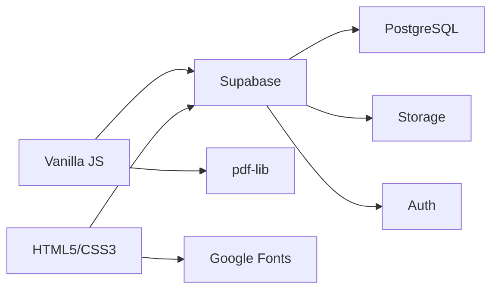
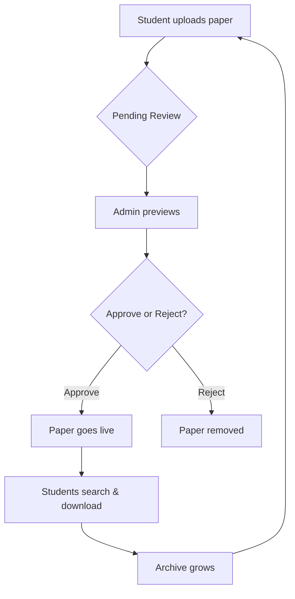

# BZU Past Papers Web App

> **The archive your seniors wished they had.** A community-powered platform where BZU students save, share, and access past exam papers across all departments.

[](https://tahirahmad88.github.io/BZUPastPapersWebApp/)
[](https://supabase.com/)
[](https://github.com/tahirahmad88/BZUPastPapersWebApp)

---

## Why This Exists

Every BZU student knows the struggle—hunting for past papers, asking seniors, searching through messy WhatsApp groups. **This platform ends that.**

**One place. Every paper. Zero hassle.**

Built by a BZU student, for BZU students. Because your seniors saved you, now you save the next batch.

---

## Features That Matter

| Feature | What It Does |
|---------|--------------|
| 🔍 **Smart Search** | Find papers by subject, teacher, session, semester in seconds, or keyworks |
| 📤 **Community Uploads** | Any student can contribute—your paper helps hundreds |
| ✅ **Quality Control** | Papers reviewed by admins before going live |
| ⭐ **Favorites** | Save papers for quick access during exam prep |
| 📦 **Batch Download** | Select multiple papers → compile into one PDF |
| 🌙 **Dark Mode** | Study late without eye strain |
| 📊 **Live Stats** | See total papers, downloads, and subjects covered |
| 🔐 **Secure** | Row Level Security (RLS) protects data integrity |

---

## Live Demo

** [BZUPastPapersWebApp](https://tahirahmad88.github.io/BZUPastPapersWebApp/)**

Go ahead—search, browse, and see how it works. No login required to explore the archive.

---

## Tech Stack



| Layer | Technology |
|-------|------------|
| **Frontend** | Vanilla JavaScript, HTML5, CSS3 (no frameworks, no bloat) |
| **Backend** | Supabase (PostgreSQL + Storage + Authentication) |
| **PDF Processing** | pdf-lib for compiling multiple papers |
| **Hosting** | GitHub Pages (static, fast, free) |
| **Fonts** | Inter + JetBrains Mono from Google Fonts |

---

## How It Works



1. **Any student** can upload a past paper (PDF, JPG, or PNG)
2. **Papers go to pending review**—no spam, no duplicates
3. **Admins preview** the actual file before approving
4. **Once approved**, it's instantly visible to everyone
5. **Community grows**—more papers, more help for everyone

---

## Key Design Decisions

| Decision | Why |
|----------|-----|
| **No build step** | Anyone can fork and run it instantly |
| **Vanilla JS** | No framework churn—works forever |
| **Supabase RLS** | Security enforced at database level, not just UI |
| **Public bucket** | Fast downloads, no signed URL overhead |
| **Admin review** | Keeps archive accurate and trustworthy |
| **Dark mode** | Default on—students study at night |

---

## For Developers

### Run Locally

```bash
# Clone the repo
git clone https://github.com/tahirahmad88/BZUPastPapersWebApp.git

# Serve locally (Python)
python3 -m http.server 8080

# Or with Node
npx serve .

# Visit http://localhost:8080
```

### Project Structure

```
BZUPastPapersWebApp/
├── index.html          # Main page
├── style.css           # All styles + dark mode
├── app.js              # Full app logic
├── supabase-config.js  # Your Supabase credentials
└── supabase-schema.sql # Database schema + RLS policies
```

### Setup Supabase

1. Create a Supabase project
2. Run `supabase-schema.sql` in the SQL editor
3. Create admin user in Authentication
4. Update `supabase-config.js` with your credentials
5. Deploy to GitHub Pages

---

## About the Creator

**Tahir Ahmad Dawar**  
Computer Engineering Student, Session 2024–2028  
Bahauddin Zakariya University, Multan

- 📧 **Email**: [tahirahmadhassukhel@gmail.com](mailto:tahirahmadhassukhel@gmail.com)
- 🔗 **LinkedIn**: [Tahir Ahmad](https://www.linkedin.com/in/tahir-ahmad-68b96b361)
- 🌐 **GitHub**: [tahirahmad88](https://github.com/tahirahmad88)

---

## Contributing

### For Students
-  **Upload papers**—every contribution helps
-  **Share with your batch**—the more papers, the better
-  **Star the repo**—show your support

### For Developers
1. Fork the repository
2. Create a feature branch (`git checkout -b feature/amazing`)
3. Commit your changes (`git commit -m 'Add amazing feature'`)
4. Push to the branch (`git push origin feature/amazing`)
5. Open a Pull Request

---

## License

This project is [MIT licensed](LICENSE)—free for anyone to use, modify, and improve.

---

## Acknowledgments

- The BZU community for submitting papers
- Supabase for an incredible platform
- Every student who has ever shared a past paper with a junior

---

<div align="center">

**⭐ If this project helped you, please give it a star! ⭐**

**Your contribution today = someone's success tomorrow.**

</div>
